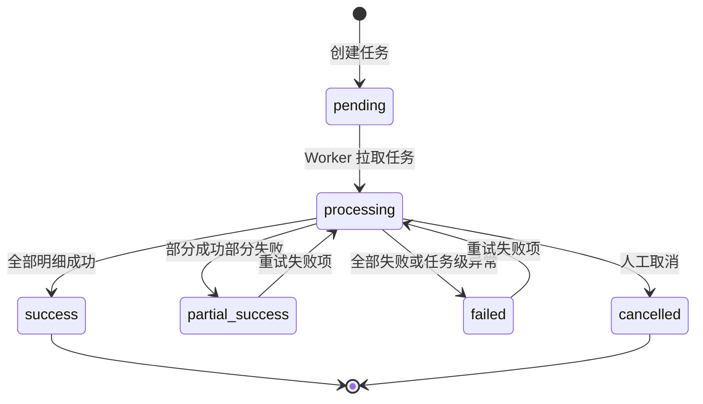
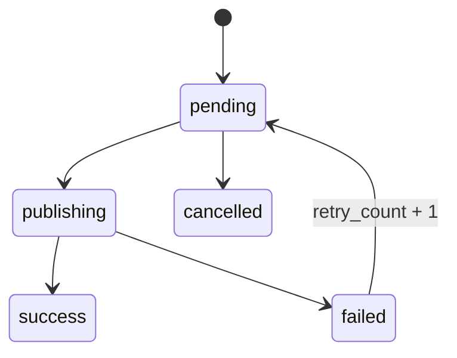

# 多店铺商品发布中台：API、页面、状态流转

## 后端 API 路由设计

### 母商品管理

| 方法 | 路径 | 说明 |
| --- | --- | --- |
| `GET` | `/api/master-products` | 母商品分页列表，支持 `keyword/category/status/page/pageSize` |
| `POST` | `/api/master-products` | 创建母商品 |
| `GET` | `/api/master-products/:id` | 母商品详情，包含素材 |
| `PUT` | `/api/master-products/:id` | 编辑母商品 |
| `DELETE` | `/api/master-products/:id` | 软删除/归档母商品 |
| `POST` | `/api/master-products/:id/assets` | 上传原始图、主图、详情图 |
| `PUT` | `/api/master-products/:id/assets/sort` | 调整图片顺序、设置主图 |
| `DELETE` | `/api/master-products/:id/assets/:assetId` | 删除素材 |

### 店铺管理

| 方法 | 路径 | 说明 |
| --- | --- | --- |
| `GET` | `/api/sales-shops` | 店铺列表 |
| `POST` | `/api/sales-shops` | 创建店铺 |
| `GET` | `/api/sales-shops/:id` | 店铺详情 |
| `PUT` | `/api/sales-shops/:id` | 编辑店铺、API 配置、绑定水印 |
| `DELETE` | `/api/sales-shops/:id` | 软删除店铺 |

### 水印模板

| 方法 | 路径 | 说明 |
| --- | --- | --- |
| `GET` | `/api/watermark-templates` | 水印模板列表 |
| `POST` | `/api/watermark-templates` | 创建模板 |
| `PUT` | `/api/watermark-templates/:id` | 编辑位置、透明度、大小、边距 |
| `POST` | `/api/watermark-templates/:id/logo` | 上传水印 Logo |
| `POST` | `/api/watermark-templates/preview` | 返回预览图，可用于服务端真实预览 |

### 多店铺发布

| 方法 | 路径 | 说明 |
| --- | --- | --- |
| `GET` | `/api/multi-shop-publish/bootstrap?masterProductId=1` | 页面初始化：母商品、店铺、水印模板、已有版本 |
| `POST` | `/api/multi-shop-publish/generate-versions` | 根据母商品和店铺配置生成店铺商品版本 |
| `GET` | `/api/multi-shop-publish/versions?masterProductId=1` | 店铺版本列表 |
| `POST` | `/api/multi-shop-publish/versions/:id/watermark` | 给指定版本图片加水印 |
| `POST` | `/api/multi-shop-publish/tasks` | 用户确认后创建发布任务 |
| `GET` | `/api/multi-shop-publish/tasks` | 发布任务列表 |
| `GET` | `/api/multi-shop-publish/tasks/:id` | 任务详情和明细 |
| `POST` | `/api/multi-shop-publish/task-items/:id/retry` | 重新发布失败项 |
| `POST` | `/api/multi-shop-publish/tasks/:id/retry-failed` | 批量重发失败项 |

### AI 图片工作台

| 方法 | 路径 | 说明 |
| --- | --- | --- |
| `POST` | `/api/ai-image-workbench/jobs` | 创建生图任务，保存 prompt 和输入图 |
| `GET` | `/api/ai-image-workbench/jobs` | 任务列表 |
| `GET` | `/api/ai-image-workbench/jobs/:id` | 任务详情 |
| `POST` | `/api/ai-image-workbench/jobs/:id/save-assets` | 将生成结果写入产品素材库 |

### 数据看板

| 方法 | 路径 | 说明 |
| --- | --- | --- |
| `GET` | `/api/multi-shop-dashboard/overview` | 曝光、点击、CTR、订单、转化率、销售额汇总 |
| `GET` | `/api/multi-shop-dashboard/by-shop` | 按店铺对比 |
| `GET` | `/api/multi-shop-dashboard/by-product` | 按商品对比 |
| `GET` | `/api/multi-shop-dashboard/by-image-version` | 按主图版本对比 |

## Vue3 页面结构

```text
frontend/admin/views/listing/
  MasterProductsView.vue              母商品管理
  SalesShopsView.vue                   店铺管理
  WatermarkTemplatesView.vue           水印模板管理
  MultiShopPublish.vue                 多店铺发布核心页面
  PublishTasksView.vue                 发布任务管理
  MultiShopDashboard.vue               数据看板

frontend/admin/components/listing/
  WatermarkPreview.vue                 水印预览组件
  ProductAssetManager.vue              商品素材管理
  ShopVersionTable.vue                 店铺版本批量编辑表格
  PublishPreviewDrawer.vue             发布预览抽屉
```

## Element Plus UI 结构

`MultiShopPublish.vue` 建议采用 ERP 操作台布局：

1. 顶部筛选区：选择母商品、查看基础信息、刷新数据。
2. 左侧或上方素材区：显示主图、详情图、库存和售价摘要。
3. 店铺配置表格：多选店铺，行内编辑标题、价格、库存、主图方案、水印模板。
4. 生成结果区：按店铺展示最终图片、水印预览、校验结果。
5. 右侧抽屉：发布预览，查看每个店铺的最终 payload。
6. 底部批量操作：全选、批量设置价格、批量设置库存、生成店铺版本、创建发布任务。

## 发布任务状态流转



明细状态：



核心规则：

- 创建任务时，`publish_tasks.status = pending`，所有 `publish_task_items.status = pending`。
- Worker 拉取任务后，任务进入 `processing`，单个明细进入 `publishing`。
- 明细发布成功后保存 `ozon_task_id/ozon_product_id/ozon_sku/product_url/response_json`，状态置为 `success`。
- 明细失败时保存 `error_message/response_json`，状态置为 `failed`。
- 每次明细状态变化后重新聚合任务计数。
- 聚合结果：
  - `success_count = total_count` 时任务为 `success`。
  - `failed_count = total_count` 时任务为 `failed`。
  - `success_count > 0 AND failed_count > 0 AND processing_count = 0 AND pending_count = 0` 时任务为 `partial_success`。
  - 仍有 `pending/publishing` 时任务为 `processing`。
- 重试失败项时，只允许 `failed` 明细变回 `pending`，同时 `retry_count + 1`，清空 `error_message`，任务变回 `processing`。

## Ozon API 扩展边界

发布服务建议拆成三层：

- `ShopVersionBuilder`：把母商品、店铺配置、图片和水印组装成店铺版本。
- `OzonPayloadMapper`：把店铺版本转成 Ozon `product/import` 请求体。
- `PublishWorker`：负责任务锁定、调用 Ozon、状态落库、失败重试。
